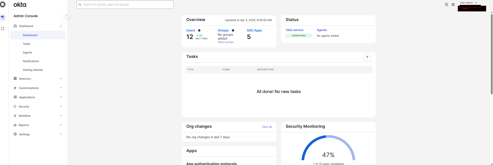

# Okta IAM Lab 🔐

A hands-on Identity and Access Management lab built on Okta Workforce Identity.
Documenting real-world IAM concepts including SSO, user lifecycle management,
group-based access control, and security policy configuration.

> 

---

## 🎯 What This Lab Covers

- Okta org setup and customization
- User creation and lifecycle management
- Group-based access control
- Administrator role assignment
- App integration with SSO (SAML/OIDC)
- Authentication and security policy configuration
- Passwordless authentication (Okta FastPass)
- Automated user provisioning
- Org monitoring and system logs

---

## 🗂️ Lab Structure

| Project | Focus | Status |
|---------|-------|--------|
| Project 1 | SSO & Identity Setup | ✅ Complete |
| Project 2 | Security Policies & MFA | ✅ Complete |
| Project 3 | Lifecycle Automation & Monitoring | ⏳ Upcoming |

---

## 🧪 Project 1 — Okta SSO & Identity Lab

### Objective
Configure an Okta org from scratch to simulate a real enterprise
identity environment including users, groups, roles, and SSO app integration.

### Skills Demonstrated
- Okta org navigation and customization
- Universal Directory user management
- Group rules and dynamic membership
- SAML-based SSO app integration
- Admin role assignment and least privilege

### Screenshots & Documentation

### 📋 Lab Write-Ups — Define Your Users in Okta

| Lab | Topic | Status |
|---|---|---|
| [Lab 01 – Add a Custom Attribute](project-1/screenshots/lab-01/lab-01-custom-attribute.md) | Extending the Okta User Profile Schema | ✅ Complete |
| [Lab 02 – Create Users in Okta](project-1/screenshots/lab-02/lab-02-create-users.md) | User Provisioning & Lifecycle Events | ✅ Complete |
| [Lab 03 – Manage User Account Statuses](project-1/screenshots/lab-03/lab-03-user-account-statuses.md) | Password Reset, Lockout, Suspend & Deactivate | ✅ Complete |
| [Lab 04 – Attribute Mappings](project-1/screenshots/lab-04/lab-04-attribute-mappings.md) | Okta to Workflows Mapping (Sandbox Limitation Documented) | ⚠️ Documented |
---
### 📋 Lab Write-Ups — Organize Users with Groups

| Lab | Topic | Status |
|---|---|---|
| [Lab 05 – Manually Assign Users to a Group](project-1/screenshots/organize-users-with-groups/lab-05/lab-05-manual-group-assignment.md) | Group Creation & Role-Based Access Control | ✅ Complete |
| [Lab 06 – Group Rule Based on Group Membership](project-1/screenshots/organize-users-with-groups/lab-06/lab-06-group-rule-membership.md) | Automated Group Assignment via Membership Logic | ✅ Complete |
| [Lab 07 – Group Rule Based on User Attribute](project-1/screenshots/organize-users-with-groups/lab-07/lab-07-group-rule-user-attribute.md) | Attribute-Based Access Control & Data Hygiene Troubleshooting | ✅ Complete |
| [Lab 08 – Okta Expression Language in a Group Rule](project-1/screenshots/organize-users-with-groups/lab-08/lab-08-okta-expression-language.md) | Compound Rule Logic & User Type Filtering | ✅ Complete |

---

## 🧪 Project 2 — Implement Security Policies

### Objective

Configure and harden an Okta org's security posture by building layered policies 
across network zones, authenticators, MFA enrollment, devices, sessions, 
authentication, and passwords — mirroring real-world enterprise access control.

### Skills Demonstrated

- IP and dynamic (geo) network zone configuration
- Authenticator setup and user-verification enforcement
- Phased rollout enrollment policies with allow/deny rules
- Device registration lifecycle management
- Global session policy tuning (lifetime, idle, persistence)
- Authentication policy design with priority-based rule evaluation
- Password policy with self-service recovery rules
- System log analysis and policy evaluation troubleshooting

### 📋 Lab Write-Ups — Implement Security Policies

| Lab | Topic | Status |
| --- | --- | --- |
| [Lab 01 – Add an IP Network Zone](./project-2/screenshots/implement-security-policies/lab-01/lab-01-ip-zone-corporate-network.md) | Corporate Network Zone via Gateway IPs | ✅ Complete |
| [Lab 02 – Add a Dynamic Network Zone](./project-2/screenshots/implement-security-policies/lab-02/lab-02-dynamic-zone-allowed-countries.md) | Geo-Based "Allowed Countries" Zone | ✅ Complete |
| [Lab 03 – Add Google Authenticator](./project-2/screenshots/implement-security-policies/lab-03/lab-03-add-google-authenticator.md) | Optional Authenticator & Default Enrollment Policy | ✅ Complete |
| [Lab 04 – Enforce User Verification for Okta Verify](./project-2/screenshots/implement-security-policies/lab-04/lab-04-enforce-user-verification-okta-verify.md) | Device Passcode / Biometric Requirement | ✅ Complete |
| [Lab 05 – Add an Enrollment Policy for Okta Verify](./project-2/screenshots/implement-security-policies/lab-05/lab-05-enrollment-policy-okta-verify.md) | Phased Rollout with Allow/Deny Rules | ✅ Complete |
| [Lab 06 – Manage Registered Devices](./project-2/screenshots/implement-security-policies/lab-06/lab-06-manage-registered-devices.md) | Device Lifecycle & Cross-Policy Troubleshooting | ✅ Complete |
| [Lab 07 – Add a Rule to Default Global Session Policy](./project-2/screenshots/implement-security-policies/lab-07/lab-07-default-global-session-policy-rule.md) | Session Lifetime, Idle Timeout & Cookie Persistence | ✅ Complete |
| [Lab 08 – Network-Zone-Based Auth Policy Rules](./project-2/screenshots/implement-security-policies/lab-08/lab-08-network-zone-auth-policy-rules.md) | Restricted / Public / Corporate Network Rules | ✅ Complete |
| [Lab 09 – Set Up a Password Policy](./project-2/screenshots/implement-security-policies/lab-09/lab-09-password-policy.md) | Strong Passwords + Self-Service Recovery by Zone | ✅ Complete |

### 📊 Module Assessment

- **Score:** 86.67% (April 24, 2026)
- **Sections:** Authentication Policies 100% · MFA Enrollment 100% · Global Session Policies 75% · Password Policies with SSR 67%
- **Credly Badge:** Earned

### 📊 Module Assessment

- **Score:** 86.67% (April 24, 2026)
- **Sections:** Authentication Policies 100% · MFA Enrollment 100% · Global Session Policies 75% · Password Policies with SSR 67%
- **Credly Badge:** Earned

---

## 🧪 Project 3 — Lifecycle Automation & Monitoring

*Coming next: Okta Workflows automation, system log monitoring, 
and end-to-end user lifecycle orchestration.*

⏳ **Status:** Upcoming
## 🛠️ Tools & Platforms
- Okta Workforce Identity (Developer Org)
- Okta Learning — Administration: Onboarding cohort
- GitHub (documentation and version control)
- Azure AD / Microsoft Entra ID *(upcoming)*

---

## 📜 Certifications In Progress
- Okta Certified Professional (target: June 2026) 🎯
- Microsoft AZ-900 ✅ (completed)

---

## 👩‍💻 About
IAM Engineer | Identity & Access Management | Cloud Security
Building enterprise-grade identity solutions across Okta and Microsoft Entra ID.

[LinkedIn](https://www.linkedin.com/in/shayna-bugg/)
