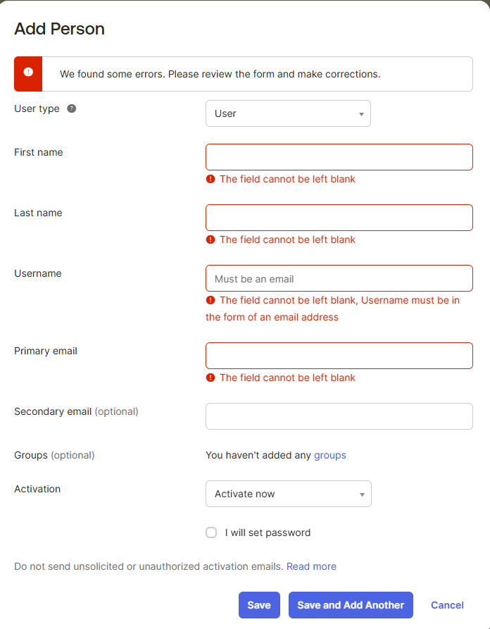
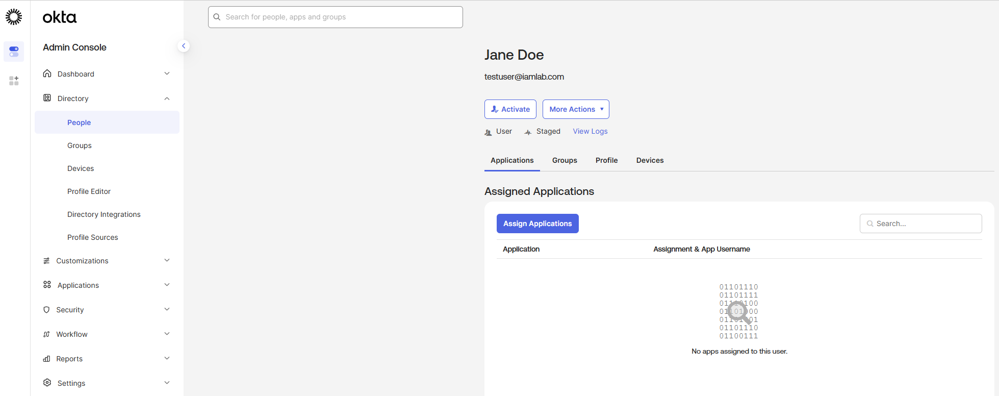
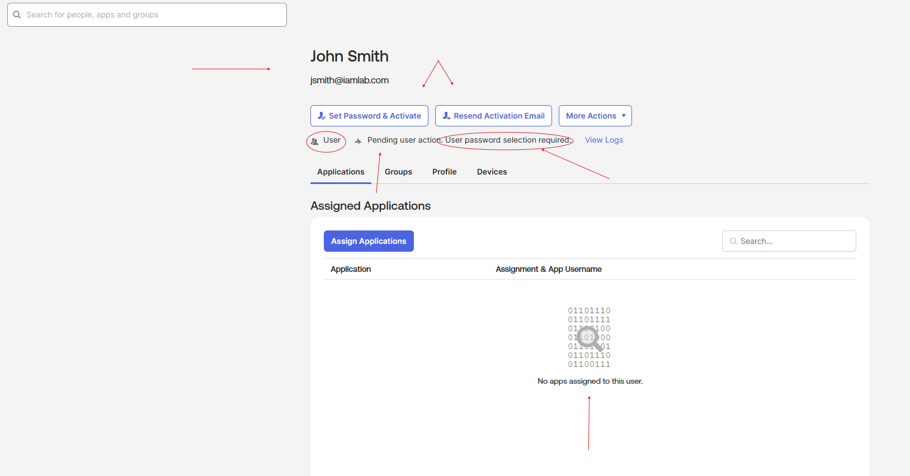
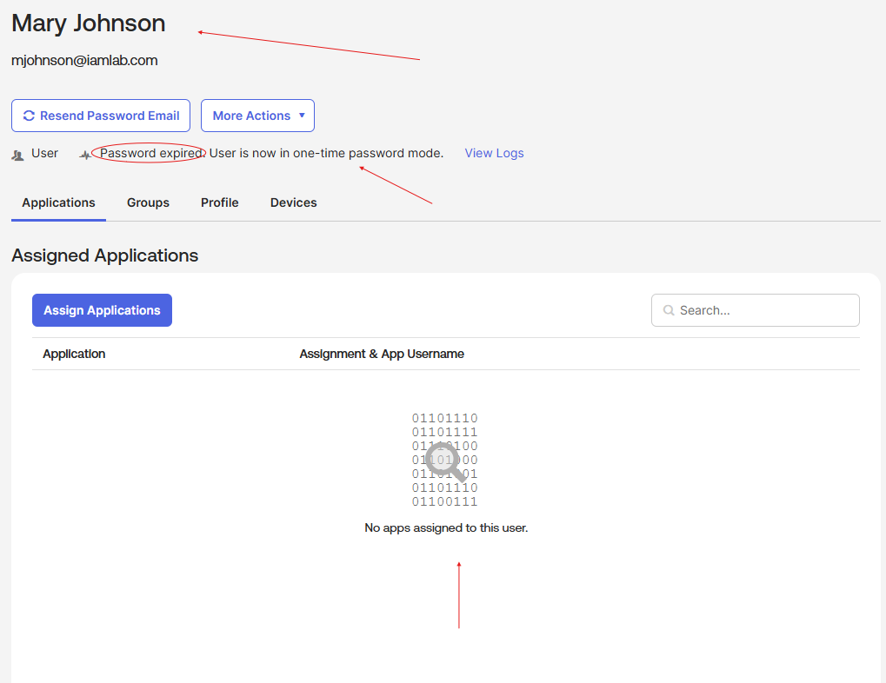
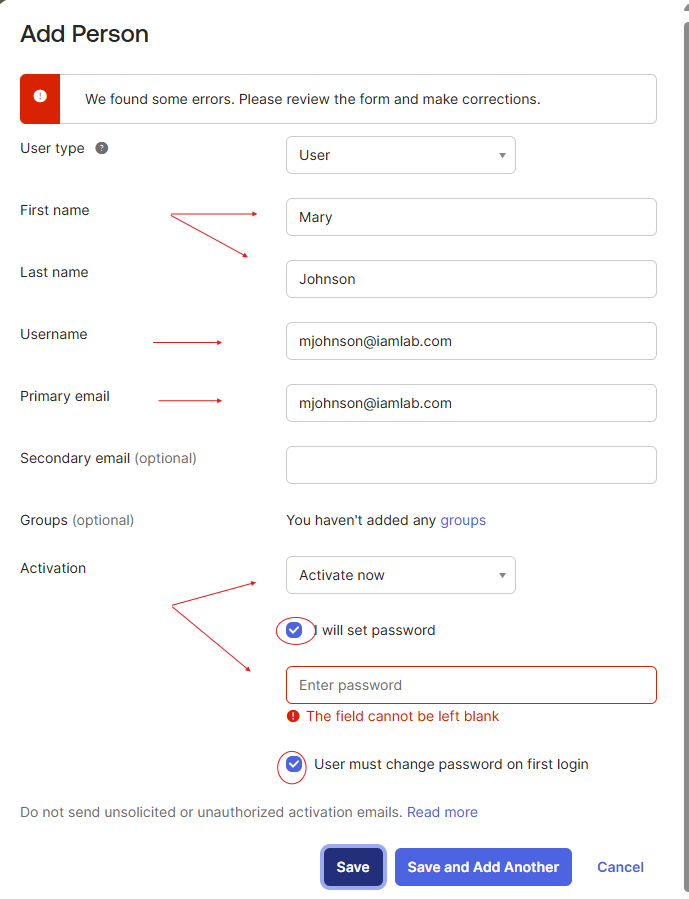
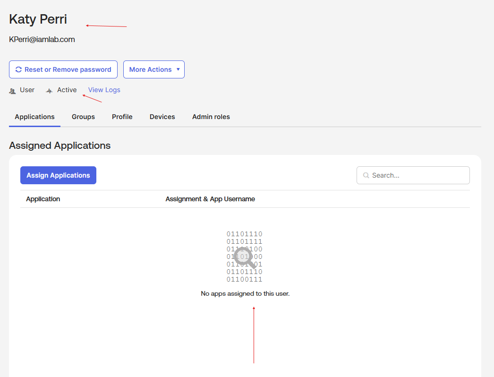

# Lab 01 — User Lifecycle Management

## Objective
Configure and observe Okta user lifecycle states by manually provisioning users 
through the Admin Console using different activation methods.

## Environment
- Platform: Okta Workforce Identity (Sandbox Org)
- Navigation: Directory > People > Add Person

---

## Scenarios & Results

| Scenario | Configuration | Resulting State |
|---|---|---|
| 1 | Required fields left blank | Validation error — user not created |
| 2 | Fields complete, Activate Later selected | Staged |
| 3 | Fields complete, Activate Now, no password set | Pending User Action |
| 4 | Fields complete, Activate Now, admin sets password + must change on first login | Password Expired |
| 5 | Fields complete, Activate Now, admin sets password, no forced reset | Active |

---

## Screenshots

### Scenario 1 — Validation Error (Empty Required Fields)

> Okta enforces required fields at the point of save. Username must be in email format.

---

### Scenario 2 — Staged User (Activate Later)

> User record created in the directory but no activation email sent. 
> Admin controls when onboarding begins.

---

### Scenario 3 — Pending User Action

> Activation email sent. Account exists but user must complete password setup 
> before access is granted.

---

### Scenario 4 — Password Expired (Admin-Set Password)

> Admin sets a temporary password. User is forced to change it on first login. 
> Account is in one-time password mode until reset is complete.

> Attempting to save without entering a password returns a validation error.

---

### Scenario 5 — Active User

> Admin sets password with no forced reset. User account is immediately Active 
> and ready for application assignment.

---

## Key Takeaways

- Okta enforces **input validation** before any user record is created
- **Staged** accounts allow HR/IT to pre-provision users before their start date
- **Pending User Action** delegates password creation to the end user
- **Password Expired** state supports temporary credential handoff with forced reset
- **Active** state grants immediate access — least restrictive, requires careful use
- User lifecycle state directly controls what actions are available in the Admin Console

---

## Real-World Relevance
In an enterprise environment, these lifecycle states map to HR onboarding workflows. 
A new hire might be created in **Staged** weeks before their start date, 
transition to **Pending** when IT sends credentials, and reach **Active** 
only after completing their first login and MFA enrollment.
