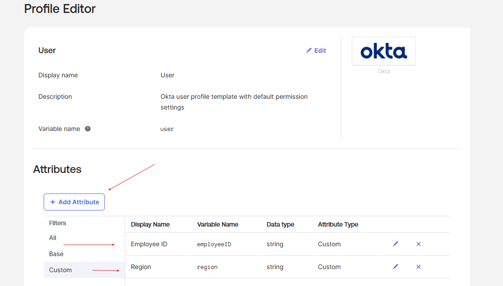

# Lab 01 – Add a Custom Attribute in Okta

## What is this?
In this lab, I extended the Okta Universal Directory by adding a custom 
attribute to the default user profile schema to track geographic region 
for users across the organization.

## Why does it matter?
The default Okta user profile doesn't cover every business need. IAM 
teams extend the profile schema to support things like regional access 
policies, cost center tracking, and compliance reporting. Custom attributes 
are foundational to lifecycle management and access control decisions.

---

## What I configured
- Navigated to Directory > Profile Editor > Okta User (default)
- Added a custom attribute with these settings:
  - Data type: String
  - Display name: Region
  - Variable name: region
  - Description: Geographic region
- Created an enumerated list restricting values to: AMER, APAC, EMEA
- Set user permission to Read Only
- Saved and verified the attribute appeared under Custom in the profile schema

*Profile Editor showing the Region custom attribute successfully added 
under the Custom attribute type. Red arrows highlight the Add Attribute 
button and the newly created Region field.*

---

## What I learned
Custom attributes extend Okta's Universal Directory to match real business 
data structures. Setting Region as Read Only ensures users cannot 
self-modify their region — only admins or automated provisioning can set 
it. This matters for access control policies that are region-dependent 
and prevents users from escalating their own access privileges.
