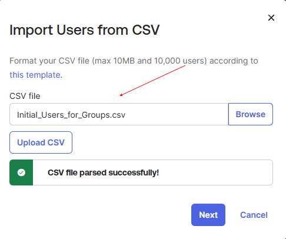
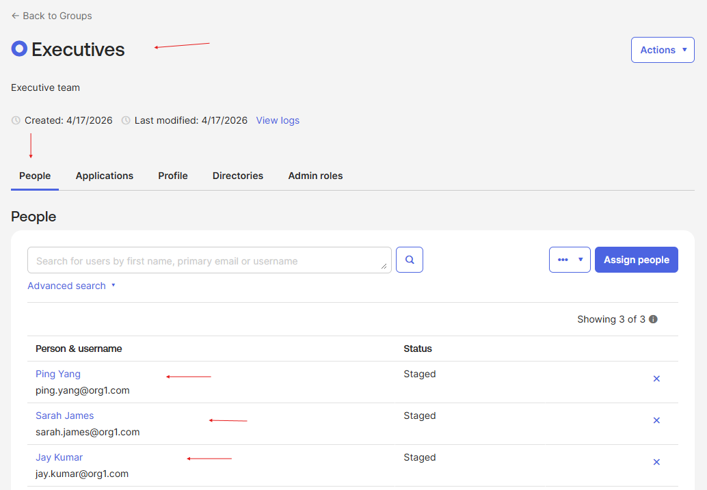
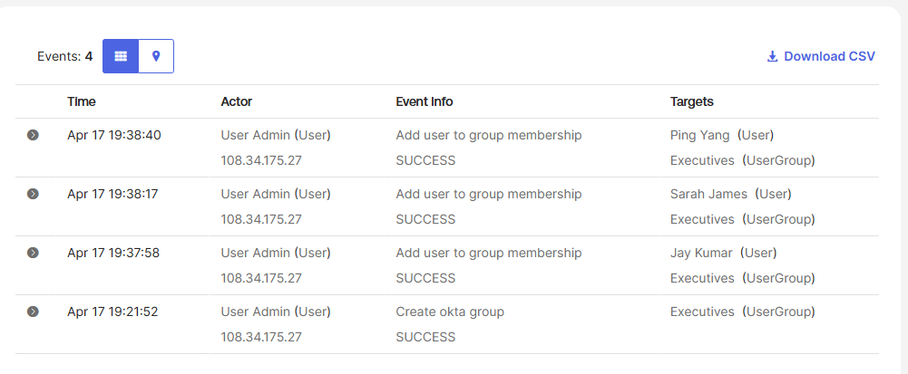

# Lab 05 – Manually Assign Users to a Group

## What is this?
In this lab, I created an Executives group in the Okta Universal Directory
and manually assigned three users to it, then audited the event log to
confirm every group action was tracked.

## Why does it matter?
Manual group assignment is the foundation of Role-Based Access Control
(RBAC). Before any automation, rule-based provisioning, or SSO policy
can function, an IAM admin needs to correctly scope users into groups
that map to business function. This mirrors the exact workflow used
when onboarding a new team into an Okta org before automation is
layered on top.

---

## What I configured
- Imported initial users into the Okta org via CSV upload
- Created an Executives group with the description "Executive team"
- Manually assigned Jay Kumar, Sarah James, and Ping Yang to the group
- Verified the assignment in the People tab of the group
- Pulled the group event log to confirm the create and assignment
  events were logged with full actor + target detail

*Initial user dataset imported into the sandbox org via CSV before
group setup began.*

*Executives group with Jay Kumar, Sarah James, and Ping Yang
successfully assigned as members.*

*System log confirming group creation and each user-assignment event
— timestamp, actor, source IP, and target object all captured.*

---

## What I learned
Every access decision in an IAM system must be auditable. Okta's
per-group event log is how an identity admin proves *who granted access,
to whom, and when* — the foundation of compliance and incident response.
Without a verifiable audit trail, an organization can't pass a SOC 2
audit or investigate a breach.
