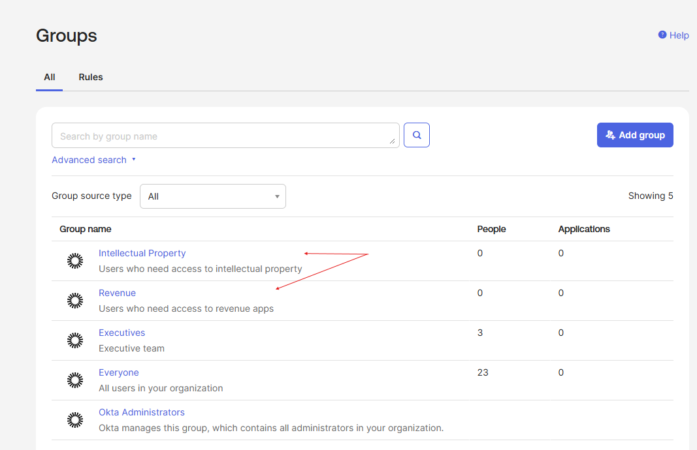
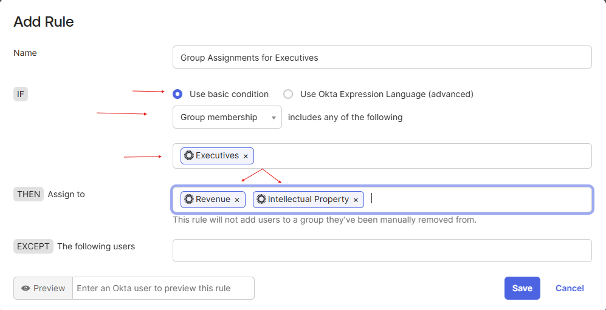
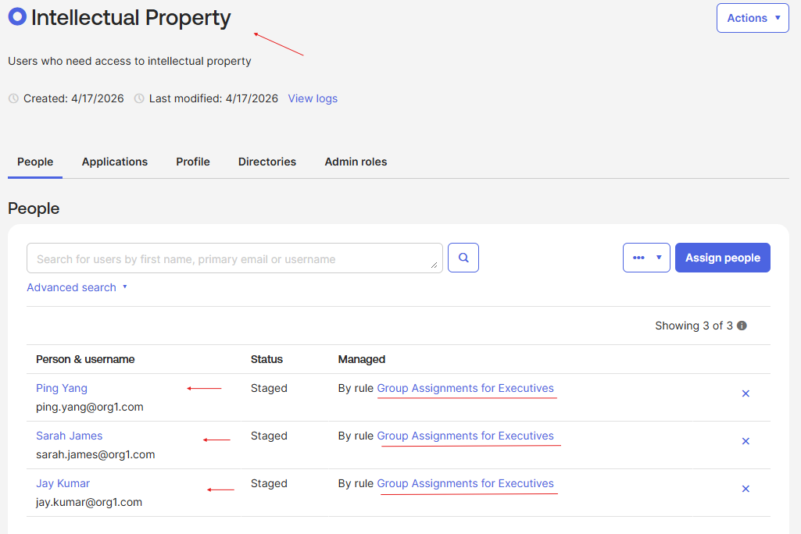
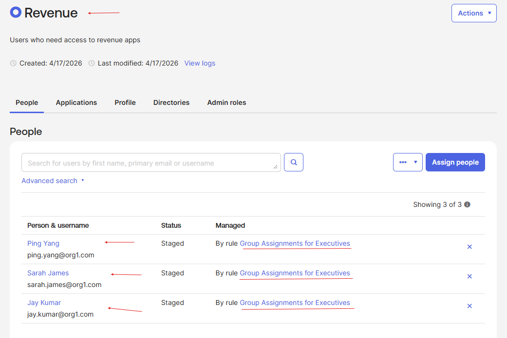
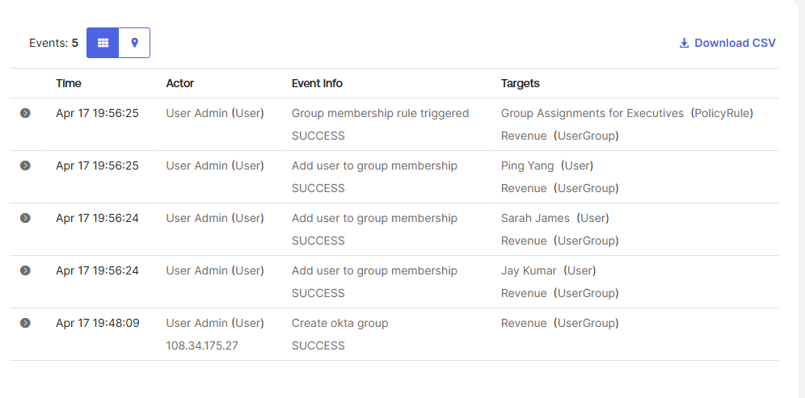

# Lab 06 – Group Rule Based on Group Membership

## What is this?
In this lab, I created two new groups — Revenue and Intellectual Property —
and built a group rule that automatically assigns any member of the
Executives group into both of them. This is the first step toward
automating access control instead of managing it by hand.

## Why does it matter?
Manually assigning users to groups doesn't scale. The moment an
organization has more than a handful of users, IAM teams switch to
rule-based assignment so access follows identity automatically. Rules
based on group membership are how companies enforce inheritance — for
example, every Executive automatically gets access to the Revenue
dashboard and Intellectual Property repositories, with no admin
intervention required when the team grows.

---

## What I configured
- Created two new groups: Revenue and Intellectual Property
- Built a group rule named "Group Assignments for Executives" using a
  basic IF/THEN condition:
  - **IF** group membership includes Executives
  - **THEN** assign users to Revenue AND Intellectual Property
- Activated the rule
- Verified that Jay Kumar, Sarah James, and Ping Yang (the Executives
  group members from Lab 05) were automatically assigned to both
  downstream groups
- Pulled the event log to confirm the rule triggered and logged each
  user-assignment event

*Revenue and Intellectual Property groups added to the org directory.*

*Rule configured with an IF condition on Executives membership and a
THEN action assigning users to both Revenue and Intellectual Property.*

*Intellectual Property group auto-populated with all three Executives,
each showing "Managed By rule Group Assignments for Executives."*

*Revenue group auto-populated with the same three users, all managed
by the same rule — confirming inheritance is working consistently
across both target groups.*

*Revenue group event log showing the "Group Assignments for Executives"
policy rule triggered successfully and each inherited user-assignment
event was logged with actor, timestamp, and target.*

---

## What I learned
Rule-based group assignment is where IAM shifts from manual work to
policy enforcement. The "Managed By rule" label on each user is
critical — it tells an admin that membership is controlled
automatically and can't be fixed by adding or removing a user by
hand. This is the foundation of Role-Based Access Control at scale:
define the rule once, and access follows identity for every current
and future user who matches the condition.
