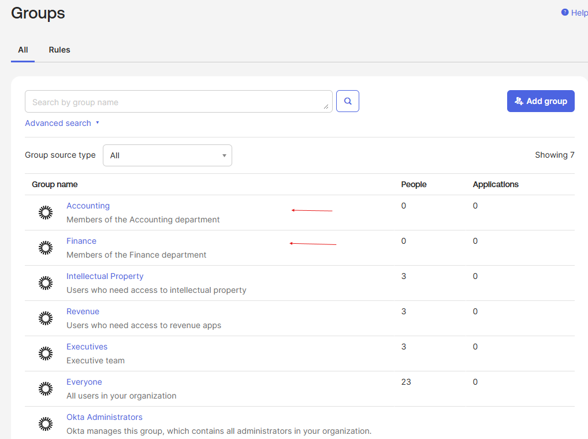
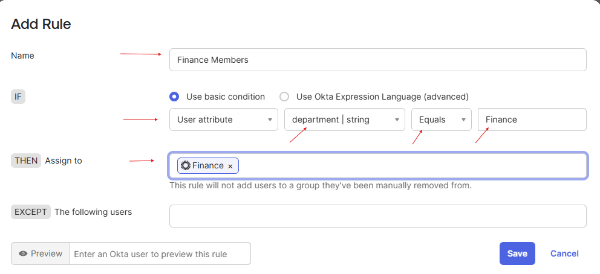
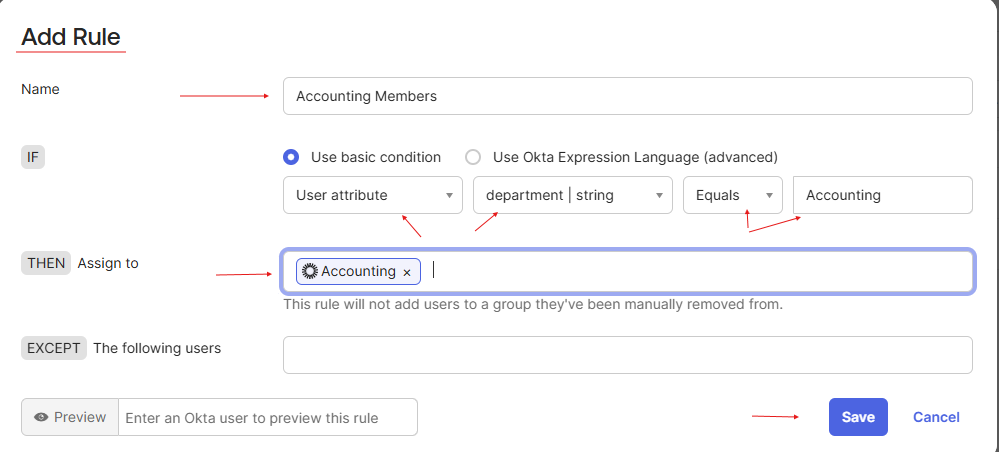
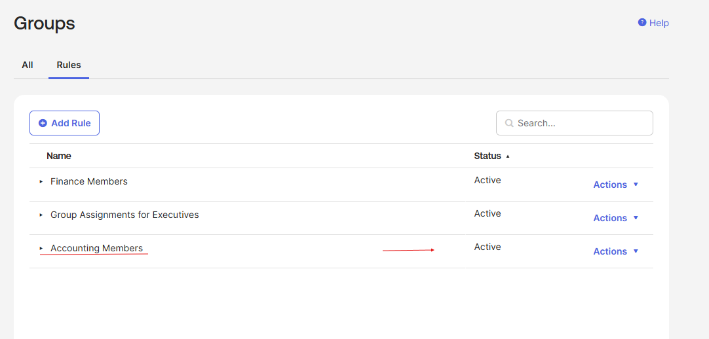
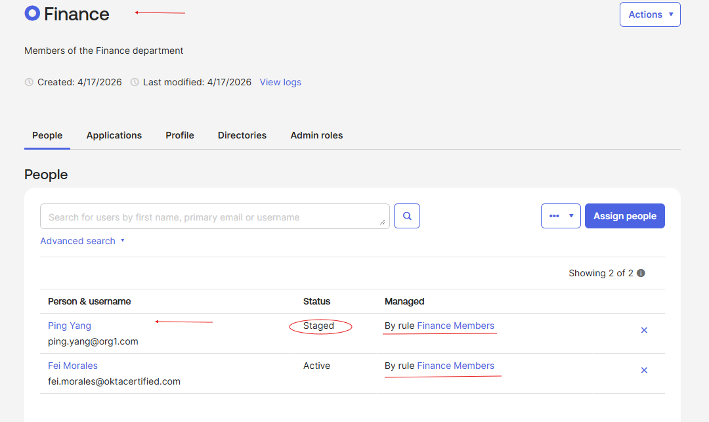
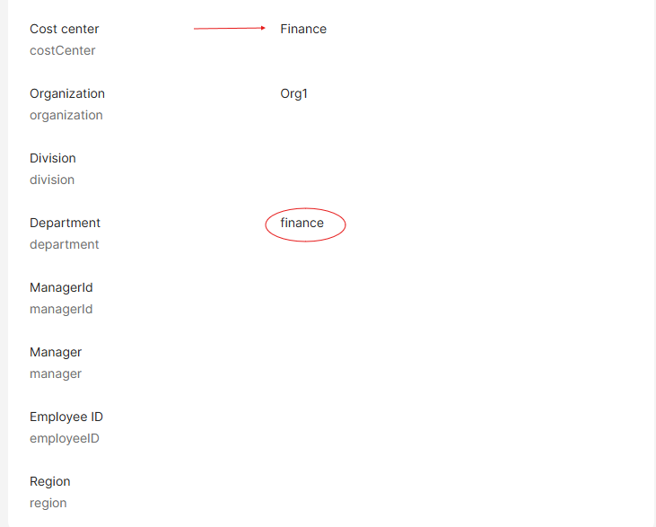
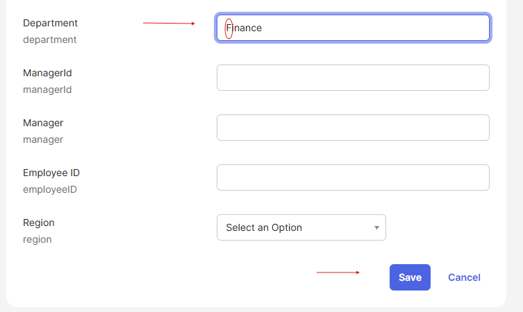
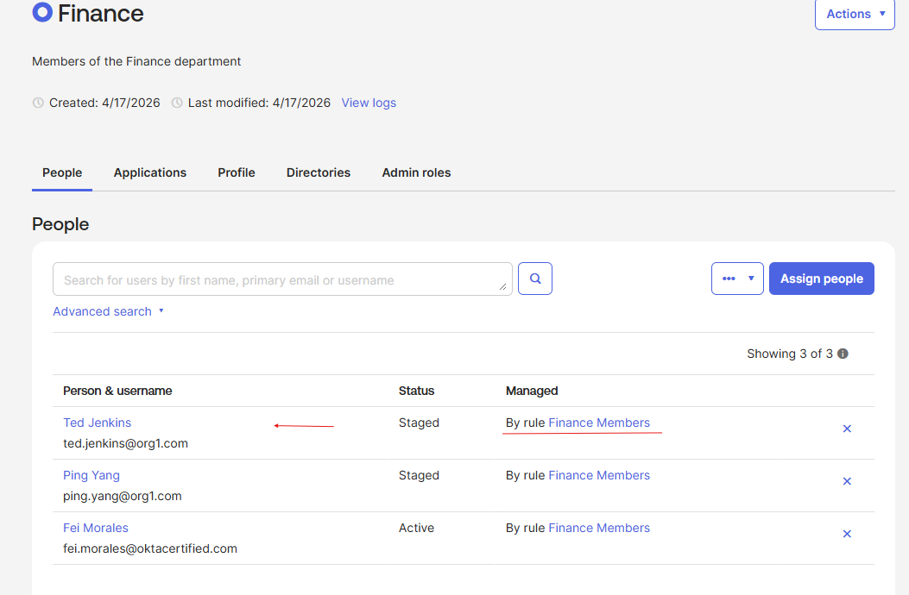
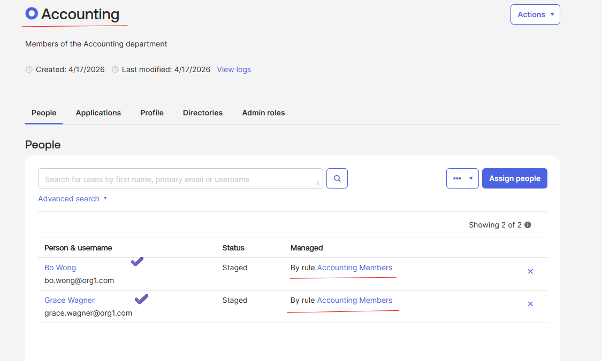

# Lab 07 – Group Rule Based on User Attribute

## What is this?
In this lab, I created Finance and Accounting groups and built rules that
automatically assign users to each group based on the value of their
department attribute. I also caught and fixed a real data hygiene issue
— a user whose department was stored as lowercase "finance" instead of
"Finance" — which prevented the rule from matching them.

## Why does it matter?
Attribute-based group assignment is how modern IAM scales across
hundreds or thousands of users. Instead of manually adding each new
hire to the right group, the rule evaluates user profile data and
routes access automatically. This is also where data quality
becomes an IAM problem: a single casing mismatch in the HRIS feed
can silently lock a user out of the systems they need. Troubleshooting
these mismatches is core to the Junior IAM Analyst role.

---

## What I configured
- Created two new groups: Finance and Accounting
- Built a group rule named "Finance Members":
  - **IF** user attribute `department` equals `Finance`
  - **THEN** assign to the Finance group
- Built a second rule named "Accounting Members":
  - **IF** user attribute `department` equals `Accounting`
  - **THEN** assign to the Accounting group
- Activated both rules
- Verified Ping Yang auto-assigned into Finance
- **Troubleshot** Ted Jenkins — his `department` value was `finance`
  (lowercase), so the rule didn't match. Edited his profile to
  `Finance` (capitalized), which triggered the rule and added him
  to the group
- Verified the Accounting group auto-populated with Bo Wong and
  Grace Wagner

*Both new groups added to the directory, ready to receive members
via attribute-based rules.*

*Finance Members rule configured to match users whose department
attribute equals "Finance" — case-sensitive match.*

*Accounting Members rule configured with the same pattern, targeting
users whose department equals "Accounting."*

*Rules tab showing both Finance Members and Accounting Members active
alongside the earlier Group Assignments for Executives rule.*

*Initial verification — Ping Yang auto-assigned into the Finance group
via the rule, confirming attribute-based assignment is functional.*

*Ted Jenkins' profile showing `department` stored as lowercase
"finance" — the reason the rule did not match his account.*

*Edited Ted Jenkins' department attribute from "finance" to "Finance"
to align with the rule's case-sensitive match condition.*

*Finance group refreshed — Ted Jenkins now appears as a member,
managed by the Finance Members rule after the profile correction.*

*Accounting group auto-populated with Bo Wong and Grace Wagner, both
managed by the Accounting Members rule.*

---

## What I learned
Group rules are only as reliable as the source data they evaluate.
Okta's rule engine performs case-sensitive matches on user attributes,
so a single inconsistency in the directory — lowercase vs. capitalized —
can silently break access provisioning for real users. This lab
reinforced that an IAM analyst's job isn't just building rules; it's
validating that profile data is clean enough for those rules to work
as intended. Data hygiene, normalization at the HRIS layer, and
attribute audits are non-negotiable parts of the role.
