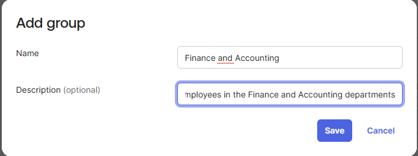
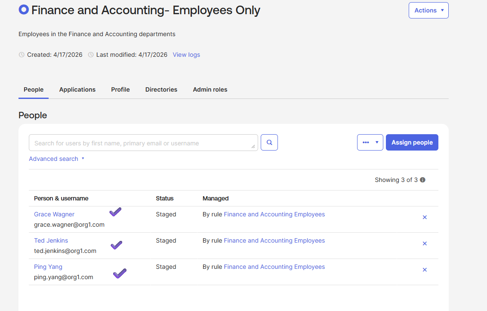
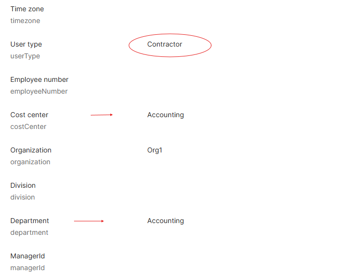

# Lab 08 – Okta Expression Language in a Group Rule

## What is this?
In this lab, I created a group called "Finance and Accounting – Employees
Only" and built a single group rule using Okta Expression Language (OEL)
to enforce compound logic: users are assigned only if they belong to
either the Finance or Accounting department AND are classified as an
Employee. This filters out Contractors automatically — a common
real-world access-control requirement.

## Why does it matter?
Basic IF/THEN rules can only evaluate one attribute at a time. Real
business policies almost always require compound conditions — for
example, "grant access only to full-time employees in specific
departments." Okta Expression Language is how IAM engineers translate
those compound business rules into enforceable policy. This is the
same skill used to segment access for contractors vs. employees,
restrict sensitive apps to specific regions, or build
conditional-access policies that combine multiple user attributes.

---

## What I configured
- Created a new group named "Finance and Accounting – Employees Only" with the description "Employees in the Finance and Accounting departments"
- Built a group rule named "Finance and Accounting Employees" using the advanced Okta Expression Language option with the following expression: `(user.department=="Finance" OR user.department=="Accounting") AND user.userType=="Employee"`
- Activated the rule
- Verified the group auto-populated with Ping Yang, Ted Jenkins, and Grace Wagner — all employees in the target departments
- Investigated why Bo Wong was excluded despite being in the Accounting department — his `userType` attribute was set to Contractor, so the AND condition correctly filtered him out

*New group "Finance and Accounting – Employees Only" created with
a description that reflects its intended scope.*

*Group rule configured using Okta Expression Language to combine
department and user type into a single compound condition.*

*Group auto-populated with Ping Yang, Ted Jenkins, and Grace Wagner
— all three managed by the "Finance and Accounting Employees" rule,
confirming the compound logic fired correctly.*

*Bo Wong's profile showing `userType` = Contractor despite
`department` = Accounting. The `AND user.userType=="Employee"`
clause in the OEL expression correctly excluded him from the group
— exactly the business outcome this rule was built to enforce.*

---

## What I learned
Okta Expression Language turns group rules from simple filters into
real policy-enforcement engines. The exclusion of Bo Wong wasn't a
bug — it was the rule working as designed. This is the core principle
of least privilege in practice: access is granted only when *every*
required condition is true, not just one. Being able to read, write,
and troubleshoot OEL expressions is a baseline skill for any IAM
analyst working in an Okta environment, and it's directly tested on
the Okta Certified Professional exam.
