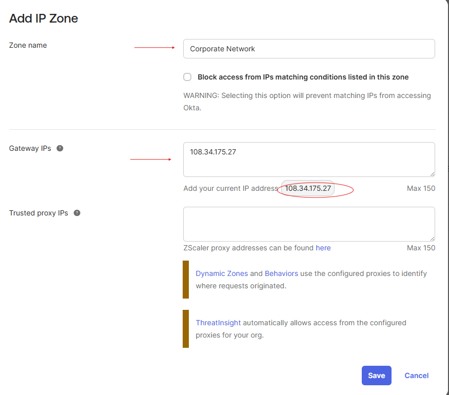
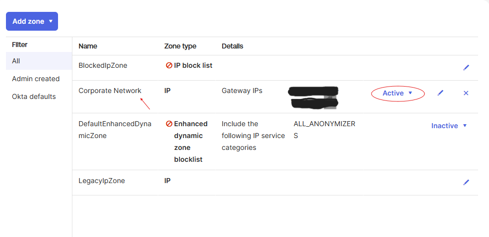

# Lab 1 — Add an IP Network Zone for the Corporate Network

## What is this?
A network zone in Okta is a defined collection of IP addresses or geographic locations that can be referenced by security policies. This lab creates an **IP zone** representing the corporate network using the current public IP as the gateway.

## Why does it matter?
Network zones are the foundation for conditional access. Without them, you can't write policies that behave differently based on where a user is connecting from. Downstream labs in this module use the Corporate Network zone to:
- Allow stronger access from inside the corporate network (Lab 8 authentication policy)
- Differentiate trusted vs. public network access in the Okta Dashboard policy

In a real enterprise, this is how IAM teams distinguish trusted office traffic from public/coffee-shop traffic without requiring a VPN for every connection.

## What I configured
1. Navigated to **Security > Networks**
2. Selected **Add zone > IP Zone**
3. Set the **Zone name** to `Corporate Network`
4. Added the current IP address as a **Gateway IP**
5. Saved and verified the zone status as **Active**

## What I learned
- **Gateway IPs vs. Trusted Proxy IPs** — Gateway IPs are the source IPs Okta evaluates against the zone. Trusted Proxy IPs are intermediaries (like load balancers) whose forwarded headers Okta should trust when determining the real client IP.
- Network zones are inert until referenced by a policy. Creating one doesn't change any enforcement on its own — it only becomes meaningful when wired into authentication, password, or enrollment policies in later labs.
- The "Active" status confirms the zone is configured correctly and ready to be referenced.
