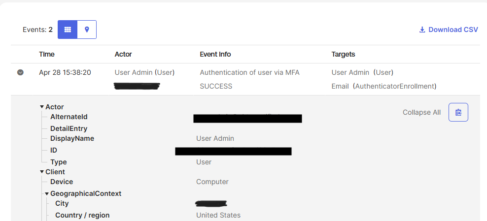
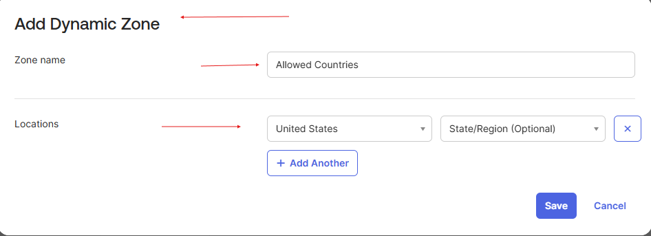
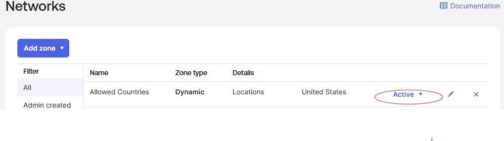

# Lab 2 — Add a Dynamic Network Zone for Allowed Countries

## What is this?
A dynamic network zone in Okta is a location-based zone that evaluates user requests using geographic data (countries, regions) derived from the source IP. This lab creates a **Dynamic Zone** named "Allowed Countries" representing the countries from which sign-ins should be permitted.

## Why does it matter?
Geo-based conditional access is a foundational control for any IAM program. Most organizations operate in a known set of countries; allowing logins from anywhere in the world unnecessarily expands the attack surface for credential stuffing, account takeover, and unauthorized access attempts from regions where no legitimate employees work.

This zone becomes the basis for downstream policies in this module:
- **Lab 5** — Allow Okta Verify enrollment only from inside this zone
- **Lab 8** — Deny dashboard access from outside this zone (Restricted Countries rule)
- **Lab 9** — Restrict self-service password recovery to inside this zone

## What I configured
1. Located my current country via **Reports > Reports > Authentication activity**, expanded the top event, and read the **Client > GeographicalContext > Country/region** value
2. Navigated to **Security > Networks**
3. Selected **Add zone > Dynamic Zone**
4. Set the **Zone name** to `Allowed Countries`
5. Added the current country (United States) from the **Locations** dropdown
6. Saved and verified the zone status as **Active**

## What I learned
- **Dynamic zones vs. IP zones** — IP zones evaluate against exact IPs or CIDR ranges (precise but brittle for distributed users); dynamic zones evaluate geo-IP lookups (broader, accepts that user IPs change but country is more stable).
- **Self-lockout caution** — Including the country I'm signed in from is critical. If I built a policy that allowed only "Allowed Countries" and didn't include my own location, I'd lose access to the admin console on the next session.
- **System Log as a configuration source** — Pulling the country directly from the System Log instead of assuming is the right pattern. It guarantees the value matches what Okta actually sees, not what I think my IP geolocates to.
- Like IP zones, dynamic zones do nothing on their own — they're configuration objects waiting to be referenced by policies.
