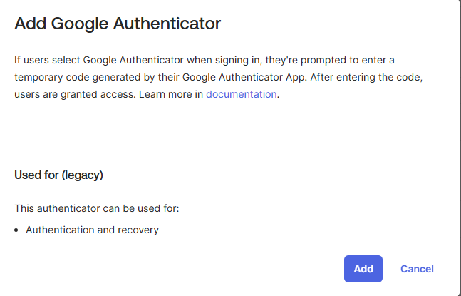
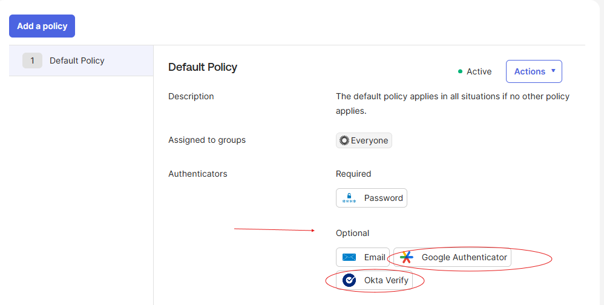
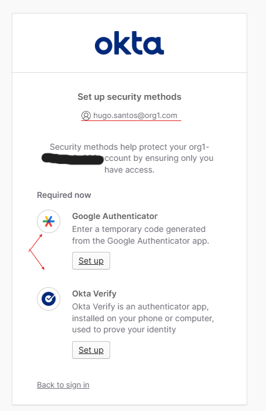
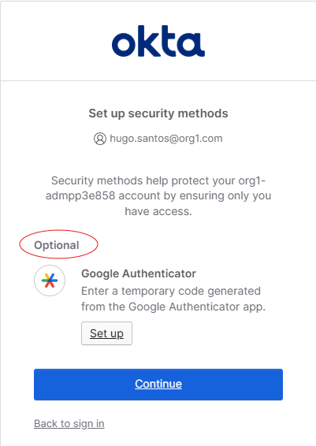

# Lab 3 — Add Google Authenticator

## What is this?
This lab adds **Google Authenticator** as an available MFA factor in the Okta org and verifies that the default authenticator enrollment policy makes both Google Authenticator and Okta Verify optional for all users. The configuration is then tested by signing in as a test user (Hugo Santos) and confirming that the user is prompted to set up at least one strong MFA factor.

## Why does it matter?
Multi-factor authentication is the highest-leverage security control in IAM, but "MFA is enabled" doesn't automatically mean "MFA is enforced." This lab surfaces the distinction between three independent layers:
- **Authenticator availability** — what factors exist in the org (managed via Security > Authenticators)
- **Enrollment policy** — what factors users *can* set up (Optional vs. Required at enrollment)
- **Authentication policy** — what factors users *must* present at sign-in

A factor only enforces MFA when all three layers align. A misconfiguration in any one of them leaves a quiet bypass path.

## What I configured
1. Navigated to **Security > Authenticators** and added **Google Authenticator** as an authenticator.
2. Verified the **Default enrollment policy** shows Google Authenticator and Okta Verify as **Optional** for Everyone.
3. Opened an incognito window and signed in as Hugo Santos to test the policy.

### Troubleshooting moment
On the first test, Hugo was able to sign in **without enrolling in Okta Verify or Google Authenticator**. Email was satisfying the second-factor requirement, which meant Hugo never hit the prompt to set up the stronger factors.

To fix it, I returned to the admin console and edited the **Email authenticator settings** so Email no longer counted toward authentication requirements. After the change:
- Hugo was correctly prompted with Google Authenticator and Okta Verify as **Required now** to meet the dashboard policy's 2-factor requirement.
- Once Hugo set up Okta Verify, Google Authenticator switched to **Optional** because Okta Verify satisfied the second-factor requirement on its own.

## What I learned
- **Authenticator "usage" matters as much as authenticator availability.** Adding Google Authenticator to the org doesn't exclude other factors from satisfying the authentication policy. Email had been quietly fulfilling the second-factor slot.
- **Authentication factor vs. recovery factor** — the same authenticator (like Email) can be configured for both purposes, or restricted to recovery only. That setting determines whether it counts toward MFA at sign-in.
- **Policy intent vs. policy effect** — the enrollment policy marked Google Auth and Okta Verify as available, but the authentication policy was what actually forced enrollment. If a weaker factor satisfies the auth policy, users have no incentive to enroll stronger ones.
- This maps directly to a real-world failure mode: admins assume MFA is enforced because they added a strong authenticator, but legacy authenticator settings still let users bypass it. **Trust the test, not the config screen.**
