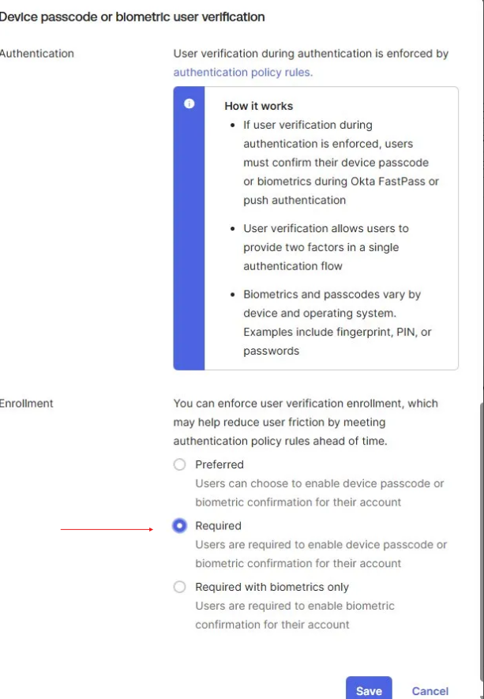

# Lab 4 — Enforce User Verification When Enrolling in Okta Verify

## What is this?
This lab modifies the **Okta Verify** authenticator settings to require users to enable a device-level verification method (passcode or biometric) when enrolling. The setting governs the Okta Verify flows including TOTP, Push notification, and Okta FastPass.

## Why does it matter?
Okta Verify by itself is a possession factor — the user has the device. Device passcode or biometric verification adds an **inherence factor** (something the user *is*) layered on top, transforming Okta Verify from "anyone holding this phone can approve" into "only the rightful owner of this unlocked phone can approve."

The real-world threat this defends against:
- **Stolen device with active session** — without device verification, an attacker who steals an unlocked phone can approve push notifications and authenticate
- **Push fatigue / MFA bombing** — even if a user accidentally approves a malicious push, device biometric requirement adds a second gate
- **Phishing-resistant authentication** — biometric + cryptographic key bound to the device is significantly harder to phish than a TOTP code typed into a fake page

A single toggle here meaningfully strengthens MFA without changing the experience for users who already have biometrics or passcodes on their devices.

## What I configured
1. Navigated to **Security > Authenticators**
2. For Okta Verify, selected **Actions > Edit**
3. Validated that users can verify with **TOTP**, **Push notification**, and **Okta FastPass**
4. In the **Device passcode or biometric user verification** section, set **Enrollment** to **Required**
5. Saved the changes

## What I learned
- **Possession + inherence is stronger than possession alone.** Okta Verify on its own proves device ownership; device verification proves the right person is using the device.
- **Preferred vs. Required vs. Required with biometrics only** — these are three different enforcement levels. "Required" allows either passcode or biometric; "Required with biometrics only" is stricter but breaks for users on devices without biometric hardware. Knowing which level to set is a real admin decision tied to the user device fleet.
- **Authenticator settings are independent of policies.** This setting applies to Okta Verify globally, regardless of which authentication or enrollment policy is in use. That's powerful but also means a single misconfiguration here affects every user enrolling Okta Verify across the org.
- Strengthening the authenticator itself is often more durable than tightening individual policies — it raises the floor for every policy that references it.
