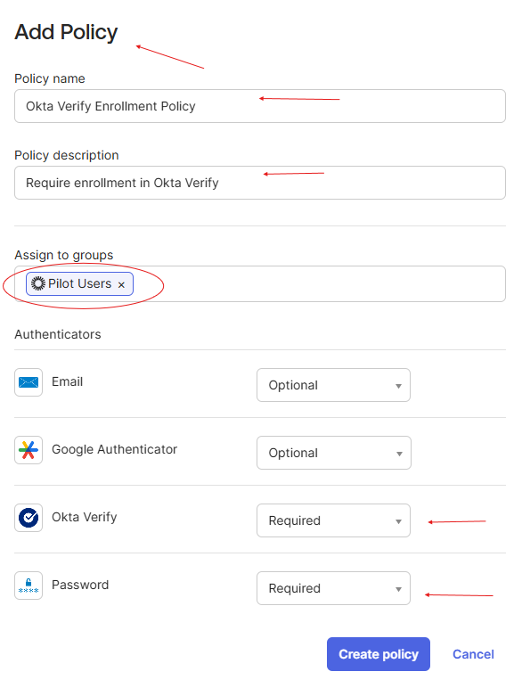
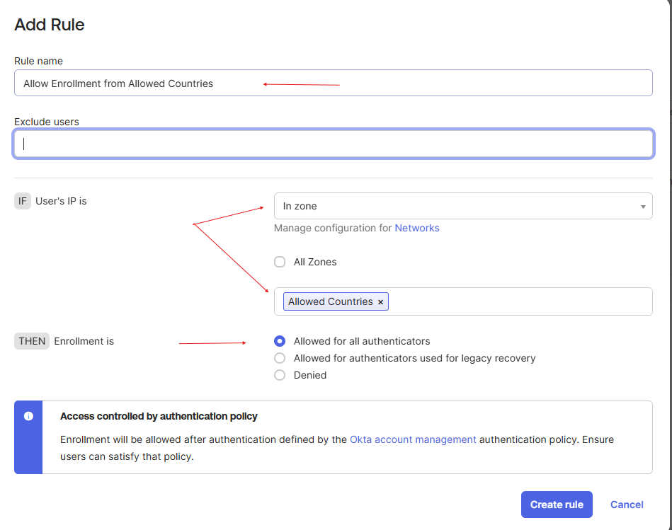
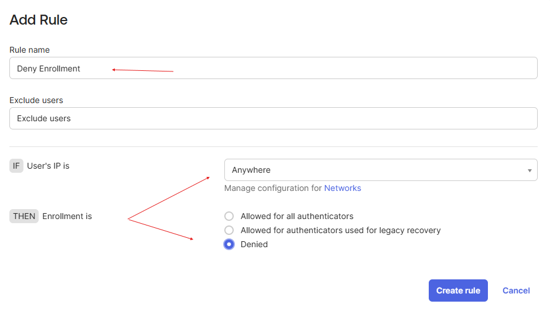
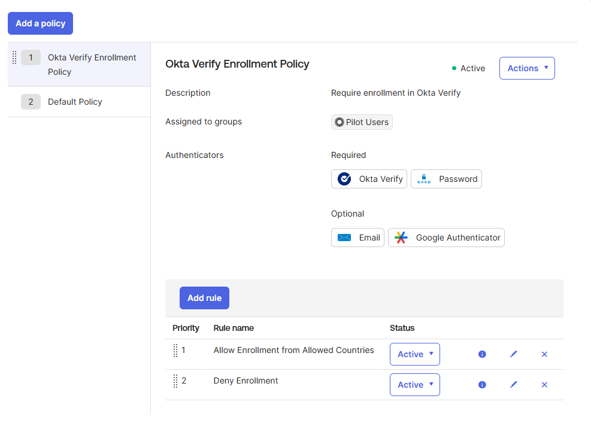
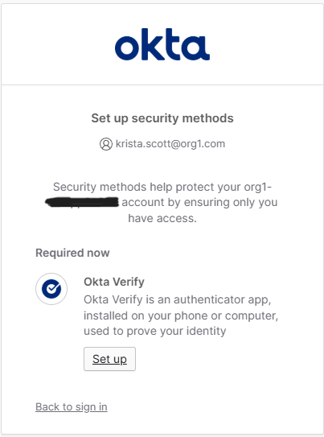
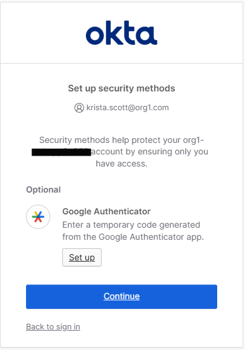

# Lab 5 — Add an Enrollment Policy for Okta Verify

## What is this?
This lab creates a custom **authenticator enrollment policy** that enforces Okta Verify + Password as required factors and conditions enrollment on the user's network zone. The policy is rolled out in phases by scoping it to the **Pilot Users** group first, leaving the rest of the org on the default enrollment policy.

The business requirement: allow Okta Verify enrollment from inside the Allowed Countries zone (built in Lab 2), and deny enrollment from anywhere else.

## Why does it matter?
This lab combines three IAM patterns that show up constantly in real environments:

1. **Phased rollouts via group scoping.** Production IAM changes never go to the whole org on day one. Pushing a new enrollment requirement to a Pilot Users group lets you validate the policy with a controlled blast radius before expanding to everyone. If something breaks, only the pilot group is affected.

2. **Network-zone-conditioned access.** The "allow from these zones, deny otherwise" pattern is the foundation of conditional access. It directly references the Allowed Countries zone built in Lab 2 — without that zone, this policy can't exist.

3. **Priority-based rule evaluation.** Okta evaluates policy rules top-down and stops at the first match. The "allow if in zone, deny everywhere else" logic requires the allow rule at priority 1 and the deny rule at priority 2. Reverse the order and the deny rule fires first, blocking everyone — including legitimate users in the allowed zone.

## What I configured
1. Navigated to **Security > Authenticators > Enrollment**
2. Added a new policy:
   - **Policy name:** Okta Verify Enrollment Policy
   - **Description:** Require enrollment in Okta Verify
   - **Assigned to:** Pilot Users group
   - **Required:** Okta Verify, Password
   - **Optional:** Email, Google Authenticator
3. Added Rule 1 — **Allow Enrollment from Allowed Countries**
   - IF User's IP is **In zone: Allowed Countries**
   - THEN Enrollment is **Allowed for all authenticators**
4. Added Rule 2 — **Deny Enrollment**
   - IF User's IP is **Anywhere**
   - THEN Enrollment is **Denied**
5. Verified Rule 2 (Deny Enrollment) is at **Priority 2** so it only fires when Rule 1 doesn't match
6. Tested by signing in as Krista Scott (Pilot Users member) in incognito:
   - Krista was correctly prompted with **Okta Verify Required**
   - After setting up Okta Verify, Google Authenticator dropped to **Optional** since the required factor was satisfied

## What I learned
- **Phased rollouts are non-negotiable for enrollment policies.** A bad enrollment policy can lock the entire org out of enrolling MFA — which, depending on the auth policy, can lock them out of signing in at all. The Pilot Users pattern is the safety net.
- **Self-lockout caution applies to admins too.** The PDF explicitly warns: don't assign yourself to the policy during testing. If the policy has a bug, the admin testing it can lose access to the org. The fix is to either exclude yourself or assign to a group you're not in.
- **Priority is policy logic.** "Allow if in zone, deny otherwise" only works because Okta evaluates top-down and stops at the first match. This isn't a "most restrictive wins" model — it's a "first match wins" model. Getting the priority wrong inverts the intended behavior.
- **Required vs. Optional in enrollment is about what users *can* set up, not what they *must* present.** A user can have Okta Verify Required at enrollment but never need it at sign-in if the authentication policy doesn't reference it. The two policies enforce different things at different moments.
- **This policy is meaningful only because Lab 2 exists.** The Allowed Countries zone is the condition this policy depends on. Without it, the "In zone" clause has nothing to evaluate against. Network zones are the connective tissue between geographic posture and authentication enforcement.
