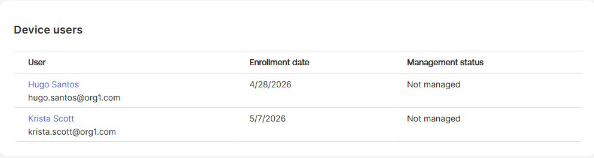
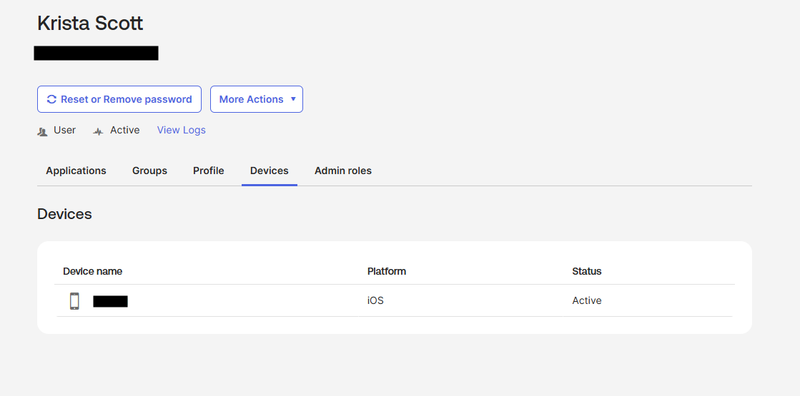
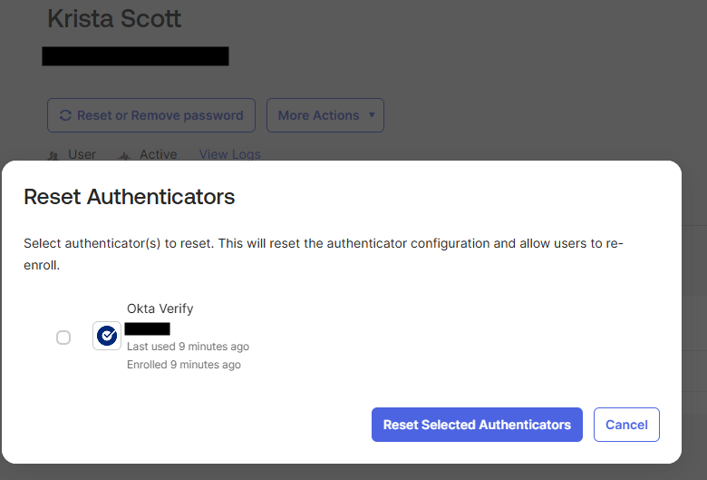

# Lab 6 — Manage Registered Devices

## What is this?
This lab walks through the complete **device lifecycle** for Okta Verify from two parallel perspectives: end-user self-service (Krista removes her own mobile device and re-enrolls Okta Verify) and admin-initiated (the help desk resets the user's authenticators from the admin console). Both paths achieve the same end state — a clean device record that the user can re-enroll on.

## Why does it matter?
This is the most common operational workflow in IAM. Real-world triggers happen constantly:
- User gets a new phone and needs to move Okta Verify to the new device
- User loses their phone and needs the old enrollment wiped before activating a replacement
- A device shows up in the activity log that the user doesn't recognize, and security needs to invalidate it
- A compromised device needs to be forcibly removed without waiting for the user

The lab's purpose isn't to introduce a new policy — it's to make the IAM admin fluent in the device-management workflow from both sides of the help desk relationship.

## What I configured

### End-user perspective (Krista)
1. Signed in as Krista Scott in an incognito browser
2. Went to **Settings > Security Methods** and removed the registered mobile device
3. Selected **Set up** for Okta Verify and re-enrolled the mobile device
4. Verified the mobile device reappeared in the Security Methods list

### Admin perspective
5. Navigated to **Directory > Devices** and selected the mobile device
6. Reviewed the users, security signals, and identifiers associated with the device
7. From the **Device users** section, selected Krista Scott
8. Opened her **Devices** tab and verified the mobile device was listed
9. Opened **More Actions > Reset Authenticators** to view the admin-side reset flow

## What I learned
- **Admin Reset Authenticators is the help desk equivalent of self-service device removal.** Both paths produce the same end-state (the device's authenticator enrollment is invalidated and the user can re-enroll), but they're invoked from different sides. Knowing both is essential — sometimes the user can do it themselves, sometimes the help desk has to step in.
- **Self-service exists for a reason.** Users with normal access to their account shouldn't have to wait for a ticket to remove their own device. The self-service path keeps routine work off the help desk queue.
- **Admin-side exists for exceptions.** When a user is locked out, the device is compromised, or the user can't be reached, admin reset is the only path. It's also the audit trail — a help desk reset is logged differently than a user self-service action.
- **Device records persist independently of authenticators.** Removing the Okta Verify enrollment doesn't delete the device from the Directory > Devices list. The device record continues to exist with its association to the user, which matters for forensics and audit history.
- **Cross-checking from both sides confirms the same state.** Looking at the device from the Devices page and then looking at the same device from the user's profile is the verification pattern: if both views agree, the system is consistent. Disagreement would signal a bug or stale state.
